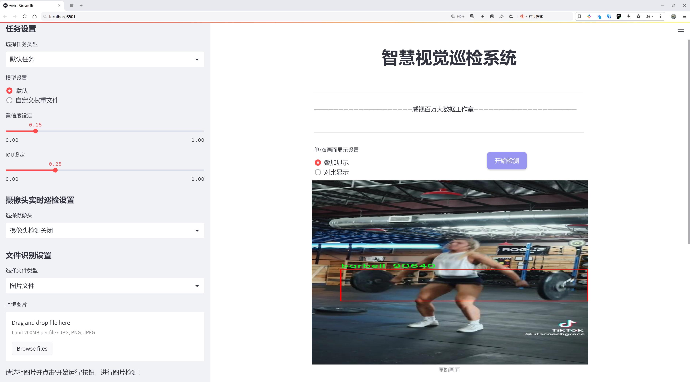
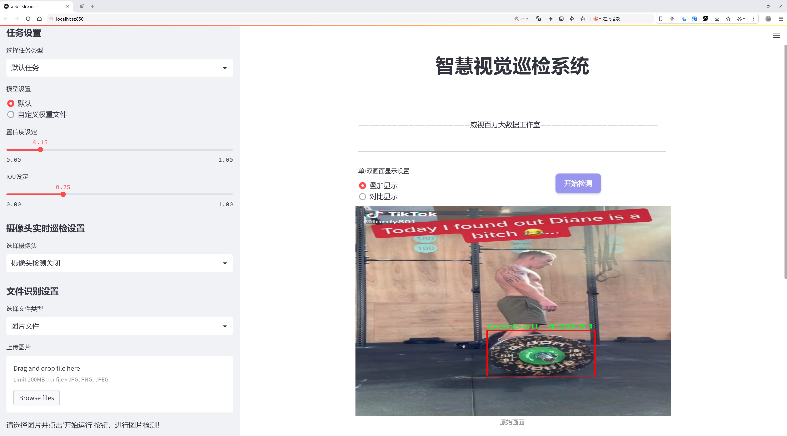
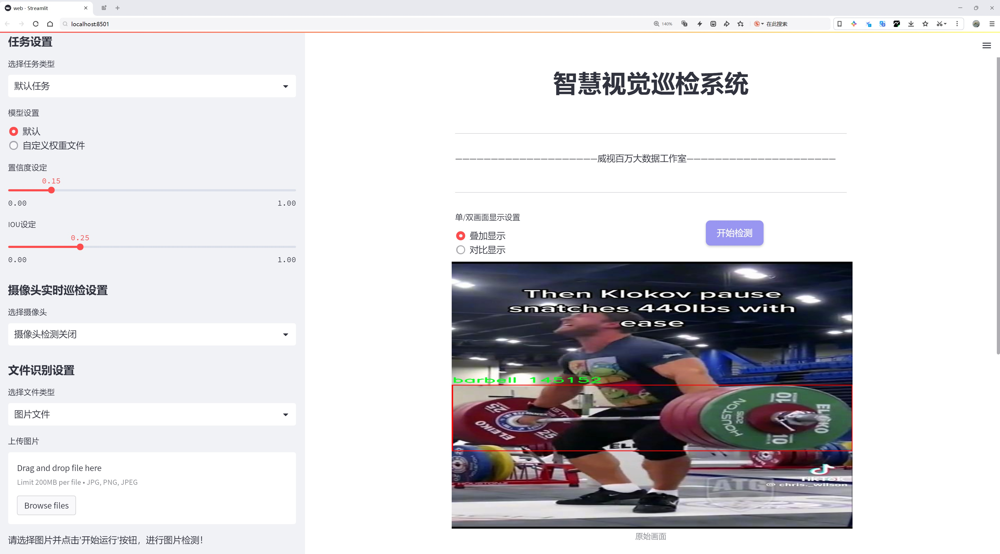
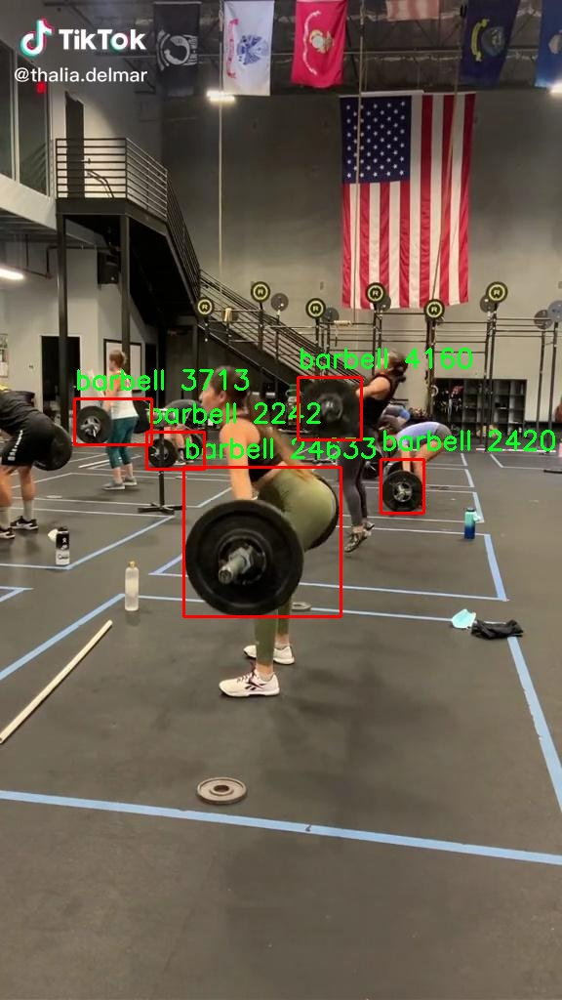
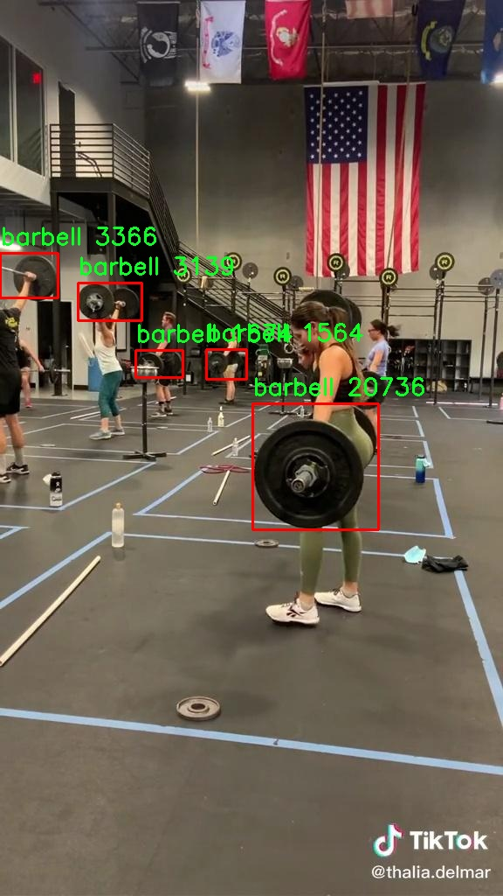
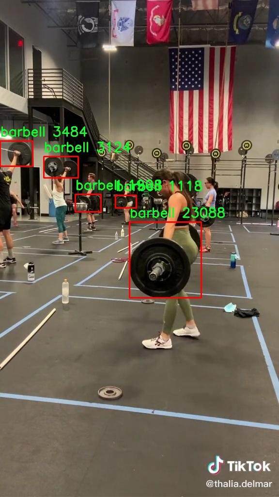
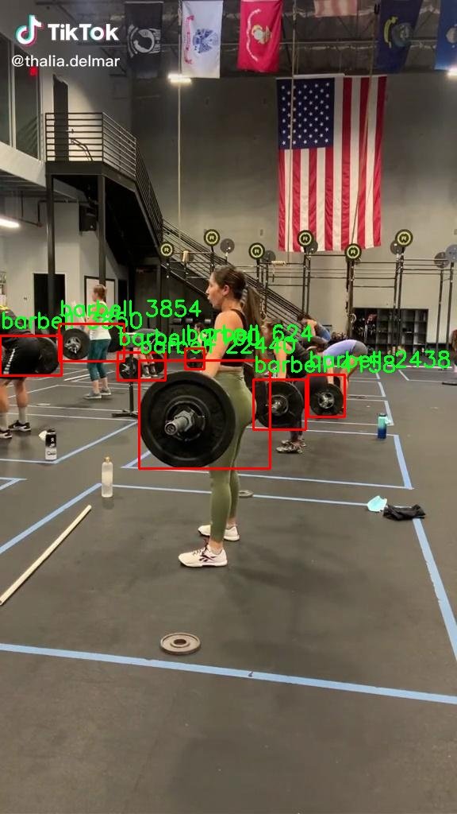
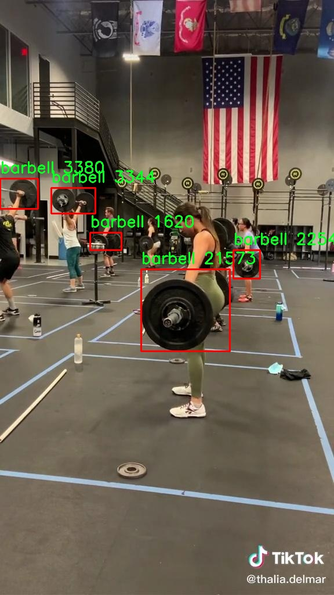

# 杠铃检测系统源码分享
 # [一条龙教学YOLOV8标注好的数据集一键训练_70+全套改进创新点发刊_Web前端展示]

### 1.研究背景与意义

项目参考[AAAI Association for the Advancement of Artificial Intelligence](https://gitee.com/qunmasj/projects)

项目来源[AACV Association for the Advancement of Computer Vision](https://kdocs.cn/l/cszuIiCKVNis)

研究背景与意义

在现代健身和力量训练的背景下，杠铃作为一种重要的训练器械，广泛应用于各种力量训练项目中。随着健身文化的普及，越来越多的人开始关注力量训练的科学性与有效性，杠铃的使用频率也随之增加。然而，传统的杠铃训练往往依赖于教练的指导，缺乏智能化的辅助工具来监测和分析训练过程中的动作质量与安全性。因此，开发一个高效、智能的杠铃检测系统显得尤为重要。基于此背景，研究基于改进YOLOv8的杠铃检测系统具有重要的现实意义和应用价值。

YOLO（You Only Look Once）系列模型以其高效的实时目标检测能力而受到广泛关注。YOLOv8作为该系列的最新版本，结合了深度学习的先进技术，具备了更高的检测精度和速度，能够在复杂的场景中快速识别目标物体。通过对YOLOv8的改进，我们可以针对杠铃这一特定目标进行优化，使其在不同的训练环境中都能保持良好的检测性能。我们的研究将利用7900张包含杠铃的图像数据集，进行模型的训练与测试，确保系统在实际应用中的可靠性和准确性。

本研究的意义不仅在于技术层面的创新，更在于其对健身行业的推动作用。通过智能化的杠铃检测系统，健身者可以实时监测自己的训练状态，及时纠正错误的动作，降低受伤风险。此外，教练也可以利用该系统对学员的训练进行科学评估，提供个性化的指导方案，从而提升训练效果。这种智能化的训练辅助工具将为健身行业带来新的变革，推动力量训练的科学化、规范化发展。

在数据集方面，我们所使用的7900张图像数据，涵盖了多种训练场景和角度，确保了模型的泛化能力。通过对这些数据的深入分析与处理，我们将能够提取出杠铃的特征信息，并在此基础上进行模型的训练与优化。这一过程不仅能够提升模型的检测精度，还能为后续的应用提供丰富的数据支持。

综上所述，基于改进YOLOv8的杠铃检测系统的研究，不仅具备重要的学术价值，也具有广泛的应用前景。随着智能技术的不断发展，健身行业亟需引入更多的科技手段来提升训练效果与安全性。本研究的开展，将为推动健身行业的智能化进程贡献一份力量，同时也为相关领域的研究提供新的思路与方法。

### 2.图片演示







##### 注意：由于此博客编辑较早，上面“2.图片演示”和“3.视频演示”展示的系统图片或者视频可能为老版本，新版本在老版本的基础上升级如下：（实际效果以升级的新版本为准）

  （1）适配了YOLOV8的“目标检测”模型和“实例分割”模型，通过加载相应的权重（.pt）文件即可自适应加载模型。

  （2）支持“图片识别”、“视频识别”、“摄像头实时识别”三种识别模式。

  （3）支持“图片识别”、“视频识别”、“摄像头实时识别”三种识别结果保存导出，解决手动导出（容易卡顿出现爆内存）存在的问题，识别完自动保存结果并导出到tempDir中。

  （4）支持Web前端系统中的标题、背景图等自定义修改，后面提供修改教程。

  另外本项目提供训练的数据集和训练教程,暂不提供权重文件（best.pt）,需要您按照教程进行训练后实现图片演示和Web前端界面演示的效果。

### 3.视频演示

[3.1 视频演示](https://www.bilibili.com/video/BV1se1kYSEDJ/)

### 4.数据集信息展示

##### 4.1 本项目数据集详细数据（类别数＆类别名）

nc: 1
names: ['barbell']


##### 4.2 本项目数据集信息介绍

数据集信息展示

在本研究中，我们使用了名为“Barbell”的数据集，以训练和改进YOLOv8模型在杠铃检测任务中的性能。该数据集专注于杠铃这一特定类别，旨在为计算机视觉领域提供高质量的训练样本，以提升目标检测的准确性和鲁棒性。数据集的类别数量为1，唯一的类别名称为“barbell”，这意味着所有的训练样本均围绕这一特定物体展开，确保模型在识别和定位杠铃时能够获得充分的学习和优化。

“Barbell”数据集的构建过程经过精心设计，旨在涵盖各种场景和条件下的杠铃图像。这些图像可能来源于不同的拍摄角度、光照条件以及背景环境，确保模型能够在多样化的实际应用中表现出色。数据集中的图像数量经过合理安排，以便为YOLOv8模型提供足够的样本量进行有效的训练和验证。每一张图像都经过标注，确保杠铃的边界框精确无误，便于模型学习其特征和位置。

在杠铃检测的任务中，准确性和实时性是两个关键指标。为此，我们在数据集中不仅注重图像的多样性，还考虑了图像的质量和标注的准确性。通过高质量的图像和精确的标注，YOLOv8模型能够更好地理解杠铃的形状、颜色和其他视觉特征，从而提高检测的准确率。此外，数据集还包含了一些特殊情况的图像，例如杠铃在不同运动场景中的使用，或与其他健身器材的组合，这为模型的泛化能力提供了良好的基础。

为了进一步提升模型的性能，我们还对数据集进行了数据增强处理。这包括旋转、缩放、裁剪和颜色调整等多种技术，以模拟不同的拍摄条件和环境变化。这种数据增强策略不仅增加了训练样本的多样性，还有效防止了模型的过拟合现象，使其在面对未见过的图像时仍能保持较高的检测精度。

在训练过程中，我们将“Barbell”数据集与YOLOv8模型的各项参数进行调优，以实现最佳的检测效果。通过不断的实验和迭代，我们能够识别出模型在特定条件下的优势和不足，从而为后续的改进提供依据。最终目标是使得改进后的YOLOv8模型在杠铃检测任务中能够达到更高的准确率和更快的处理速度，满足实际应用的需求。

综上所述，“Barbell”数据集不仅为杠铃检测提供了丰富的样本和标注支持，还通过多样化的图像和数据增强策略，为YOLOv8模型的训练和优化奠定了坚实的基础。随着研究的深入，我们期待该数据集能够在推动计算机视觉技术进步的同时，为健身器材的智能识别和管理提供有力支持。











### 5.全套项目环境部署视频教程（零基础手把手教学）

[5.1 环境部署教程链接（零基础手把手教学）](https://www.ixigua.com/7404473917358506534?logTag=c807d0cbc21c0ef59de5)


[5.2 安装Python虚拟环境创建和依赖库安装视频教程链接（零基础手把手教学）](https://www.ixigua.com/7404474678003106304?logTag=1f1041108cd1f708b01a)

### 6.手把手YOLOV8训练视频教程（零基础小白有手就能学会）

[6.1 手把手YOLOV8训练视频教程（零基础小白有手就能学会）](https://www.ixigua.com/7404477157818401292?logTag=d31a2dfd1983c9668658)


按照上面的训练视频教程链接加载项目提供的数据集，运行train.py即可开始训练



     Epoch   gpu_mem       box       obj       cls    labels  img_size
     1/200     20.8G   0.01576   0.01955  0.007536        22      1280: 100%|██████████| 849/849 [14:42<00:00,  1.04s/it]
               Class     Images     Labels          P          R     mAP@.5 mAP@.5:.95: 100%|██████████| 213/213 [01:14<00:00,  2.87it/s]
                 all       3395      17314      0.994      0.957      0.0957      0.0843

     Epoch   gpu_mem       box       obj       cls    labels  img_size
     2/200     20.8G   0.01578   0.01923  0.007006        22      1280: 100%|██████████| 849/849 [14:44<00:00,  1.04s/it]
               Class     Images     Labels          P          R     mAP@.5 mAP@.5:.95: 100%|██████████| 213/213 [01:12<00:00,  2.95it/s]
                 all       3395      17314      0.996      0.956      0.0957      0.0845

     Epoch   gpu_mem       box       obj       cls    labels  img_size
     3/200     20.8G   0.01561    0.0191  0.006895        27      1280: 100%|██████████| 849/849 [10:56<00:00,  1.29it/s]
               Class     Images     Labels          P          R     mAP@.5 mAP@.5:.95: 100%|███████   | 187/213 [00:52<00:00,  4.04it/s]
                 all       3395      17314      0.996      0.957      0.0957      0.0845


### 7.70+种全套YOLOV8创新点代码加载调参视频教程（一键加载写好的改进模型的配置文件）

[7.1 70+种全套YOLOV8创新点代码加载调参视频教程（一键加载写好的改进模型的配置文件）](https://www.ixigua.com/7404478314661806627?logTag=29066f8288e3f4eea3a4)

### 8.70+种全套YOLOV8创新点原理讲解（非科班也可以轻松写刊发刊，V10版本正在科研待更新）

#### 由于篇幅限制，每个创新点的具体原理讲解就不一一展开，具体见下列网址中的创新点对应子项目的技术原理博客网址【Blog】：


[8.1 70+种全套YOLOV8创新点原理讲解链接](https://gitee.com/qunmasj/good)

#### 部分改进原理讲解(完整的改进原理见上图和技术博客链接)

### YOLOv8简介
YoloV8模型结构
YOLOv3之前的所有YOLO对象检测模型都是用C语言编写的，并使用了Darknet框架，Ultralytics发布了第一个使用PyTorch框架实现的YOLO (YOLOv3)；YOLOv3之后，Ultralytics发布了YOLOv5，在2023年1月，Ultralytics发布了YOLOv8，包含五个模型，用于检测、分割和分类。 YOLOv8 Nano是其中最快和最小的，而YOLOv8 Extra Large (YOLOv8x)是其中最准确但最慢的，具体模型见后续的图。

YOLOv8附带以下预训练模型:

目标检测在图像分辨率为640的COCO检测数据集上进行训练。
实例分割在图像分辨率为640的COCO分割数据集上训练。
图像分类模型在ImageNet数据集上预训练，图像分辨率为224。
YOLOv8 概述
具体到 YOLOv8 算法，其核心特性和改动可以归结为如下：

提供了一个全新的SOTA模型（state-of-the-art model），包括 P5 640 和 P6 1280 分辨率的目标检测网络和基于YOLACT的实例分割模型。和 YOLOv5 一样，基于缩放系数也提供了 N/S/M/L/X 尺度的不同大小模型，用于满足不同场景需求
骨干网络和 Neck 部分可能参考了 YOLOv7 ELAN 设计思想，将 YOLOv5 的 C3 结构换成了梯度流更丰富的 C2f 结构，并对不同尺度模型调整了不同的通道数，属于对模型结构精心微调，不再是一套参数应用所有模型，大幅提升了模型性能。
Head 部分相比 YOLOv5 改动较大，换成了目前主流的解耦头结构，将分类和检测头分离，同时也从Anchor-Based 换成了 Anchor-Free
Loss 计算方面采用了TaskAlignedAssigner正样本分配策略，并引入了Distribution Focal Loss
训练的数据增强部分引入了 YOLOX 中的最后 10 epoch 关闭 Mosiac 增强的操作，可以有效地提升精度


### HRNet V2简介
现在设计高低分辨率融合的思路主要有以下四种：


（a）对称结构。如U-Net、Hourglass等，都是先下采样再上采样，上下采样过程对称。

（b）级联金字塔。如refinenet等，高低分辨率融合时经过卷积处理。

（c）简单的baseline，用转职卷积进行上采样。

（d）扩张卷积。如deeplab等，增大感受野，减少下采样次数，可以无需跳层连接直接进行上采样。

（b）（c）都是使用复杂一些的网络进行下采样（如resnet、vgg），再用轻量级的网络进行上采样。

HRNet V1是在（b）的基础上进行改进，从头到尾保持大的分辨率表示。然而HRNet V1仅是用在姿态估计领域的，HRNet V2对它做小小的改进可以使其适用于更广的视觉任务。这一改进仅仅增加了较小的计算开销，但却提升了较大的准确度。

#### 网络结构图：


这个结构图简洁明了就不多介绍了，首先图2的输入是已经经过下采样四倍的feature map，横向的conv block指的是basicblock 或 bottleblock，不同分辨率之间的多交叉线部分是multi-resolution convolution（多分辨率组卷积）。

到此为止HRNet V2和HRNet V1是完全一致的。

区别之处在于这个基网络上加的一个head：


图3介绍的是接在图2最后的head。（a）是HRNet V1的头，很明显他只用了大分辨率的特征图。（b）（c）是HRNet V2的创新点，（b）用与语义分割，（c）用于目标检测。除此之外作者还在实验部分介绍了用于分类的head，如图4所示。


#### 多分辨率block：


一个多分辨率block由多分辨率组卷积（a）和多分辨率卷积（b）组成。（c）是一个正常卷积的展开，（b）的灵感来源于（c）。代码中（a）部分由Bottleneck和BasicBlock组成。

多分辨率卷积和正常卷积的区别：（1）多分辨率卷积中，每个通道的subset的分辨率都不一样。（2）通道之间的连接如果是降分辨率，则用的是3x3的2stride的卷积，如果是升分辨率，用的是双线性最邻近插值上采样。


### 9.系统功能展示（检测对象为举例，实际内容以本项目数据集为准）

图9.1.系统支持检测结果表格显示

  图9.2.系统支持置信度和IOU阈值手动调节

  图9.3.系统支持自定义加载权重文件best.pt(需要你通过步骤5中训练获得)

  图9.4.系统支持摄像头实时识别

  图9.5.系统支持图片识别

  图9.6.系统支持视频识别

  图9.7.系统支持识别结果文件自动保存

  图9.8.系统支持Excel导出检测结果数据


### 10.原始YOLOV8算法原理

原始YOLOv8算法原理

YOLOv8算法作为YOLO系列目标检测算法的最新版本，承载着对前几代算法的创新与改进，展现出更为卓越的性能与灵活性。其设计理念不仅继承了YOLOv5和YOLOv7的核心思想，还在此基础上进行了深度优化，以适应日益复杂的目标检测任务。YOLOv8的架构主要由输入层、主干网络、特征融合层和解耦头组成，形成了一个高效的目标检测系统。

在主干网络方面，YOLOv8继续采用YOLOv5的CSPDarknet结构，但进行了重要的改进。具体而言，YOLOv8将YOLOv5中的C3模块替换为C2f模块，这一变化旨在实现模型的轻量化，同时保持甚至提升检测精度。C2f模块的设计灵感来源于ELAN（Efficient Layer Aggregation Network），通过引入多条分支和shortcut连接，C2f模块能够有效缓解深层网络中的梯度消失问题，增强特征的重用性。这种设计使得网络在处理复杂特征时更加高效，尤其是在处理小目标和细节特征时，能够显著提升检测的准确性。

特征融合层采用了PAN-FPN（Path Aggregation Network with Feature Pyramid Network）结构，这一结构在YOLOv8中得到了进一步的优化。PAN-FPN通过自下而上的特征融合，结合了浅层和深层特征，确保了不同尺度特征之间的有效整合。在这一过程中，YOLOv8去除了YOLOv5中上采样阶段的1x1卷积，直接将高层特征进行上采样并与中层特征进行拼接，从而实现了更为精确的特征融合。这种设计不仅提升了特征的表达能力，还增强了模型对多尺度目标的检测能力，使得YOLOv8在复杂场景下依然能够保持高效的检测性能。

YOLOv8在目标检测中采用了Anchor-Free的思想，摒弃了传统的Anchor-Base方法。这一创新使得模型在处理不同形状和尺寸的目标时，能够更加灵活，减少了对Anchor的依赖，从而降低了模型的复杂性和计算成本。通过引入Task-Aligned的样本匹配策略，YOLOv8实现了更加智能的样本匹配，进一步提升了训练效率和检测精度。

在损失函数的设计上，YOLOv8引入了VFLLoss作为分类损失，并结合DFLLoss和CIoULoss作为回归损失。这种组合损失函数的设计旨在解决目标检测中常见的样本不平衡问题，尤其是在处理小目标时，能够有效提升模型的学习能力。通过优化损失函数，YOLOv8在训练过程中能够更好地聚焦于难以识别的样本，从而提升整体检测性能。

在数据预处理方面，YOLOv8沿用了YOLOv5的策略，采用了多种数据增强手段，如马赛克增强、混合增强、空间扰动和颜色扰动等。这些增强手段的应用，能够有效提升模型的泛化能力，使其在不同环境和条件下都能保持较高的检测精度。

YOLOv8的Head部分借鉴了YOLOX和YOLOv6的解耦头设计，取消了objectness分支，采用了基于FCOS的目标检测方法。该方法通过将分类和回归分支解耦，简化了模型的结构，同时提高了检测的效率和准确性。YOLOv8的Head部分输出的特征图尺度为80x80、40x40和20x20，能够覆盖不同大小的目标，确保了对各种目标的有效检测。

在损失函数的优化上，YOLOv8采用了Focal Loss来解决样本不平衡的问题，尤其是在处理小目标时，能够有效提升模型的学习能力。通过调整平衡参数和聚焦参数，YOLOv8能够更好地聚焦于难以识别的样本，从而提升整体检测性能。

综上所述，YOLOv8算法通过一系列创新与改进，展现出强大的目标检测能力。其在主干网络、特征融合、样本匹配、损失函数等多个方面的优化，使得YOLOv8在处理复杂场景和多尺度目标时，能够保持高效的检测性能。随着YOLOv8的推出，目标检测领域将迎来新的发展机遇，为各类应用场景提供更加精准和高效的解决方案。


### 11.项目核心源码讲解（再也不用担心看不懂代码逻辑）

#### 11.1 code\ultralytics\utils\torch_utils.py

以下是对您提供的代码的核心部分进行分析和详细注释的结果。代码主要涉及 PyTorch 相关的工具函数和模型操作，特别是与 YOLO 模型相关的功能。

```python
import math
import os
import platform
import random
import time
from contextlib import contextmanager
from copy import deepcopy
from pathlib import Path
import torch
import torch.nn as nn
import torch.nn.functional as F
import torchvision

# 选择合适的设备（CPU或GPU）
def select_device(device="", batch=0, newline=False, verbose=True):
    """
    根据提供的参数选择合适的 PyTorch 设备。

    参数:
        device (str | torch.device, optional): 设备字符串或 torch.device 对象。
        batch (int, optional): 模型使用的批量大小。默认为 0。
        newline (bool, optional): 如果为 True，则在日志字符串末尾添加换行符。默认为 False。
        verbose (bool, optional): 如果为 True，则记录设备信息。默认为 True。

    返回:
        (torch.device): 选择的设备。
    """
    # 处理设备字符串，移除不必要的字符
    device = str(device).lower().replace("cuda:", "").replace("none", "").strip()
    
    # 检查是否请求使用 CPU 或 MPS（Apple Metal Performance Shaders）
    cpu = device == "cpu"
    mps = device in ("mps", "mps:0")
    
    # 如果请求使用 CPU 或 MPS，则设置环境变量
    if cpu or mps:
        os.environ["CUDA_VISIBLE_DEVICES"] = "-1"  # 强制 PyTorch 不可用 CUDA
    else:
        # 处理请求的 CUDA 设备
        if device == "cuda":
            device = "0"
        os.environ["CUDA_VISIBLE_DEVICES"] = device  # 设置环境变量
        # 检查 CUDA 是否可用
        if not (torch.cuda.is_available() and torch.cuda.device_count() >= len(device.split(","))):
            raise ValueError(f"Invalid CUDA 'device={device}' requested.")

    # 根据可用设备返回相应的 torch.device 对象
    if not cpu and torch.cuda.is_available():
        return torch.device(f"cuda:{device.split(',')[0]}")
    elif mps and torch.backends.mps.is_available():
        return torch.device("mps")
    else:
        return torch.device("cpu")

# 时间同步函数，确保 CUDA 操作完成
def time_sync():
    """PyTorch 精确时间同步。"""
    if torch.cuda.is_available():
        torch.cuda.synchronize()  # 同步 CUDA 操作
    return time.time()  # 返回当前时间

# 融合卷积层和批归一化层
def fuse_conv_and_bn(conv, bn):
    """融合 Conv2d() 和 BatchNorm2d() 层。"""
    # 创建一个新的卷积层，设置为不需要梯度
    fusedconv = nn.Conv2d(
        conv.in_channels,
        conv.out_channels,
        kernel_size=conv.kernel_size,
        stride=conv.stride,
        padding=conv.padding,
        dilation=conv.dilation,
        groups=conv.groups,
        bias=True,
    ).requires_grad_(False).to(conv.weight.device)

    # 准备卷积层的权重
    w_conv = conv.weight.clone().view(conv.out_channels, -1)
    w_bn = torch.diag(bn.weight.div(torch.sqrt(bn.eps + bn.running_var)))  # 归一化权重
    fusedconv.weight.copy_(torch.mm(w_bn, w_conv).view(fusedconv.weight.shape))  # 融合权重

    # 准备偏置
    b_conv = torch.zeros(conv.weight.size(0), device=conv.weight.device) if conv.bias is None else conv.bias
    b_bn = bn.bias - bn.weight.mul(bn.running_mean).div(torch.sqrt(bn.running_var + bn.eps))
    fusedconv.bias.copy_(torch.mm(w_bn, b_conv.reshape(-1, 1)).reshape(-1) + b_bn)  # 融合偏置

    return fusedconv  # 返回融合后的卷积层

# 获取模型信息
def model_info(model, detailed=False, verbose=True, imgsz=640):
    """
    获取模型信息。

    imgsz 可以是 int 或 list，例如 imgsz=640 或 imgsz=[640, 320]。
    """
    if not verbose:
        return
    n_p = get_num_params(model)  # 获取参数数量
    n_g = get_num_gradients(model)  # 获取梯度数量
    n_l = len(list(model.modules()))  # 获取层数
    if detailed:
        # 详细输出每一层的信息
        for i, (name, p) in enumerate(model.named_parameters()):
            print(f"{i} {name} {p.requires_grad} {p.numel()} {list(p.shape)} {p.mean()} {p.std()}")

    flops = get_flops(model, imgsz)  # 获取 FLOPs
    print(f"Model summary: {n_l} layers, {n_p} parameters, {n_g} gradients, {flops:.1f} GFLOPs")
    return n_l, n_p, n_g, flops  # 返回模型信息

# 获取模型的参数数量
def get_num_params(model):
    """返回 YOLO 模型中的参数总数。"""
    return sum(x.numel() for x in model.parameters())  # 计算所有参数的数量

# 获取模型的梯度数量
def get_num_gradients(model):
    """返回 YOLO 模型中具有梯度的参数总数。"""
    return sum(x.numel() for x in model.parameters() if x.requires_grad)  # 计算具有梯度的参数数量

# 初始化模型权重
def initialize_weights(model):
    """初始化模型权重为随机值。"""
    for m in model.modules():
        if isinstance(m, nn.Conv2d):
            nn.init.kaiming_normal_(m.weight, mode='fan_out', nonlinearity='relu')  # Kaiming 初始化
        elif isinstance(m, nn.BatchNorm2d):
            m.eps = 1e-3  # 设置 epsilon
            m.momentum = 0.03  # 设置动量

# 设置随机种子
def init_seeds(seed=0, deterministic=False):
    """初始化随机数生成器（RNG）种子。"""
    random.seed(seed)  # 设置 Python 随机种子
    np.random.seed(seed)  # 设置 NumPy 随机种子
    torch.manual_seed(seed)  # 设置 PyTorch 随机种子
    torch.cuda.manual_seed(seed)  # 设置 CUDA 随机种子
    if deterministic:
        torch.use_deterministic_algorithms(True)  # 使用确定性算法

# 早停类
class EarlyStopping:
    """早停类，当指定的 epoch 数量过去而没有改进时停止训练。"""

    def __init__(self, patience=50):
        """初始化早停对象。"""
        self.best_fitness = 0.0  # 最佳适应度
        self.best_epoch = 0  # 最佳 epoch
        self.patience = patience  # 允许的耐心值

    def __call__(self, epoch, fitness):
        """检查是否停止训练。"""
        if fitness is None:
            return False

        if fitness >= self.best_fitness:  # 如果当前适应度更好
            self.best_epoch = epoch
            self.best_fitness = fitness
        # 检查是否超过耐心值
        return (epoch - self.best_epoch) >= self.patience
```

### 代码分析总结
1. **设备选择**：`select_device` 函数用于选择适合的计算设备（CPU或GPU），并处理相关的环境变量。
2. **时间同步**：`time_sync` 函数确保在进行时间测量时，CUDA 操作已经完成。
3. **模型操作**：包括融合卷积层和批归一化层的函数（`fuse_conv_and_bn`），以及获取模型信息的函数（`model_info`）。
4. **参数和梯度计算**：提供了获取模型参数和梯度数量的功能。
5. **权重初始化**：`initialize_weights` 函数用于初始化模型的权重。
6. **随机种子设置**：`init_seeds` 函数用于设置随机种子以确保实验的可重复性。
7. **早停机制**：`EarlyStopping` 类用于在训练过程中监控模型的性能，并在没有改进时停止训练。

以上是对代码的核心部分进行了简化和注释，保留了重要的功能和逻辑。

这个文件是一个用于深度学习模型（特别是YOLO系列模型）训练和推理的工具模块，主要依赖于PyTorch库。它包含了一系列函数和类，旨在简化模型的训练、设备选择、参数管理、性能评估等任务。

首先，文件导入了一些必要的库，包括数学计算、操作系统、随机数生成、时间管理、上下文管理器、深拷贝、路径处理和类型提示等。它还导入了NumPy和PyTorch相关的模块，以及Ultralytics特定的工具和日志记录功能。

文件中定义了多个函数。`torch_distributed_zero_first`是一个上下文管理器，用于在分布式训练中确保所有进程在本地主进程完成某些操作之前等待。`smart_inference_mode`函数根据PyTorch的版本选择合适的推理模式装饰器，以提高推理效率。

`select_device`函数用于选择合适的计算设备（CPU或GPU），并验证设备的可用性。它还会设置环境变量以指定使用的GPU。`time_sync`函数用于同步CUDA时间，以确保时间测量的准确性。

`fuse_conv_and_bn`和`fuse_deconv_and_bn`函数用于将卷积层和批归一化层融合，以减少模型的计算量和提高推理速度。`model_info`函数用于输出模型的基本信息，包括参数数量、层数和计算复杂度（FLOPs）。

`initialize_weights`函数用于初始化模型的权重，确保在训练开始时权重处于合理的状态。`scale_img`函数用于根据给定的比例缩放和填充图像张量，以适应模型输入的要求。

`strip_optimizer`函数用于从训练好的模型中去除优化器信息，以便在推理时减小模型的大小。`profile`函数用于评估模型的速度、内存使用和计算复杂度，帮助开发者优化模型性能。

此外，文件中还定义了`ModelEMA`类，用于实现模型的指数移动平均（EMA），这是一种在训练过程中平滑模型参数的方法，有助于提高模型的泛化能力。`EarlyStopping`类用于实现早停机制，当模型在一定轮次内没有性能提升时，停止训练以避免过拟合。

总的来说，这个文件提供了一系列实用的工具和功能，旨在支持YOLO模型的训练和推理过程，帮助开发者更高效地进行深度学习实验。

#### 11.2 ui.py

以下是保留的核心代码部分，并附上详细的中文注释：

```python
import sys
import subprocess

def run_script(script_path):
    """
    使用当前 Python 环境运行指定的脚本。

    Args:
        script_path (str): 要运行的脚本路径

    Returns:
        None
    """
    # 获取当前 Python 解释器的路径
    python_path = sys.executable

    # 构建运行命令，使用 streamlit 运行指定的脚本
    command = f'"{python_path}" -m streamlit run "{script_path}"'

    # 执行命令
    result = subprocess.run(command, shell=True)
    # 检查命令执行结果，如果返回码不为0，则表示出错
    if result.returncode != 0:
        print("脚本运行出错。")

# 实例化并运行应用
if __name__ == "__main__":
    # 指定要运行的脚本路径
    script_path = "web.py"  # 假设脚本在当前目录下

    # 调用函数运行脚本
    run_script(script_path)
```

### 代码注释说明：
1. **导入模块**：
   - `sys`：用于访问与 Python 解释器相关的变量和函数。
   - `subprocess`：用于执行外部命令。

2. **`run_script` 函数**：
   - 功能：在当前 Python 环境中运行指定的脚本。
   - 参数：`script_path` 是要运行的脚本的路径。
   - 过程：
     - 使用 `sys.executable` 获取当前 Python 解释器的路径。
     - 构建一个命令字符串，用于调用 `streamlit` 运行指定的脚本。
     - 使用 `subprocess.run` 执行构建的命令，并将 `shell` 参数设置为 `True`，允许在 shell 中执行命令。
     - 检查命令的返回码，如果不为0，打印错误信息。

3. **主程序部分**：
   - 使用 `if __name__ == "__main__":` 确保只有在直接运行该脚本时才会执行以下代码。
   - 指定要运行的脚本路径为 `web.py`。
   - 调用 `run_script` 函数，传入脚本路径以执行该脚本。

这个程序文件的主要功能是使用当前的 Python 环境来运行一个指定的脚本，具体来说是一个名为 `web.py` 的脚本。程序首先导入了必要的模块，包括 `sys`、`os` 和 `subprocess`，这些模块分别用于获取系统信息、处理文件路径和执行外部命令。

在 `run_script` 函数中，首先获取当前 Python 解释器的路径，这通过 `sys.executable` 实现。接着，构建一个命令字符串，这个命令会调用 `streamlit` 模块来运行指定的脚本。`streamlit` 是一个用于构建数据应用的库，因此这个程序的目的可能是启动一个基于 `streamlit` 的 Web 应用。

随后，使用 `subprocess.run` 方法执行构建好的命令。这个方法会在一个新的 shell 中运行命令，并等待其完成。如果命令执行后返回的状态码不为零，表示脚本运行出错，程序会打印出错误信息。

在文件的最后部分，使用 `if __name__ == "__main__":` 语句来确保当该文件作为主程序运行时，才会执行后面的代码。这里指定了要运行的脚本路径 `web.py`，并调用 `run_script` 函数来执行这个脚本。

整体来看，这个程序是一个简单的脚本启动器，旨在方便地运行一个特定的 Python 脚本，并且在运行过程中提供错误反馈。

#### 11.3 code\ultralytics\models\sam\amg.py

以下是代码中最核心的部分，并附上详细的中文注释：

```python
import torch

def is_box_near_crop_edge(
    boxes: torch.Tensor, crop_box: List[int], orig_box: List[int], atol: float = 20.0
) -> torch.Tensor:
    """
    判断给定的边界框是否接近裁剪边缘。

    参数：
    - boxes: 要检查的边界框，格式为 (x1, y1, x2, y2) 的张量。
    - crop_box: 当前裁剪框的边界，格式为 [x0, y0, x1, y1]。
    - orig_box: 原始图像的边界框，格式为 [x0, y0, x1, y1]。
    - atol: 允许的绝对误差，默认为 20.0。

    返回：
    - 一个布尔张量，指示每个边界框是否接近裁剪边缘。
    """
    # 将裁剪框和原始框转换为张量
    crop_box_torch = torch.as_tensor(crop_box, dtype=torch.float, device=boxes.device)
    orig_box_torch = torch.as_tensor(orig_box, dtype=torch.float, device=boxes.device)
    
    # 将边界框从裁剪坐标转换回原始坐标
    boxes = uncrop_boxes_xyxy(boxes, crop_box).float()
    
    # 检查边界框是否接近裁剪框的边缘
    near_crop_edge = torch.isclose(boxes, crop_box_torch[None, :], atol=atol, rtol=0)
    # 检查边界框是否接近原始图像的边缘
    near_image_edge = torch.isclose(boxes, orig_box_torch[None, :], atol=atol, rtol=0)
    
    # 只保留接近裁剪边缘但不接近原始图像边缘的框
    near_crop_edge = torch.logical_and(near_crop_edge, ~near_image_edge)
    
    # 返回是否有任何边界框接近裁剪边缘
    return torch.any(near_crop_edge, dim=1)


def uncrop_boxes_xyxy(boxes: torch.Tensor, crop_box: List[int]) -> torch.Tensor:
    """
    将裁剪的边界框转换回原始图像坐标。

    参数：
    - boxes: 裁剪后的边界框，格式为 (x1, y1, x2, y2) 的张量。
    - crop_box: 当前裁剪框的边界，格式为 [x0, y0, x1, y1]。

    返回：
    - 转换后的边界框，格式为 (x1, y1, x2, y2) 的张量。
    """
    x0, y0, _, _ = crop_box  # 解包裁剪框的坐标
    offset = torch.tensor([[x0, y0, x0, y0]], device=boxes.device)  # 计算偏移量
    
    # 检查 boxes 是否有通道维度
    if len(boxes.shape) == 3:
        offset = offset.unsqueeze(1)  # 如果有通道维度，增加一个维度
    
    # 返回转换后的边界框
    return boxes + offset


def batched_mask_to_box(masks: torch.Tensor) -> torch.Tensor:
    """
    计算掩膜周围的边界框，格式为 XYXY。

    参数：
    - masks: 二进制掩膜，形状为 C1xC2x...xHxW。

    返回：
    - 边界框，形状为 C1xC2x...x4。
    """
    # 如果掩膜为空，返回 [0,0,0,0]
    if torch.numel(masks) == 0:
        return torch.zeros(*masks.shape[:-2], 4, device=masks.device)

    # 将掩膜形状规范化为 CxHxW
    shape = masks.shape
    h, w = shape[-2:]
    masks = masks.flatten(0, -3) if len(shape) > 2 else masks.unsqueeze(0)
    
    # 获取上下边缘
    in_height, _ = torch.max(masks, dim=-1)
    in_height_coords = in_height * torch.arange(h, device=in_height.device)[None, :]
    bottom_edges, _ = torch.max(in_height_coords, dim=-1)
    in_height_coords = in_height_coords + h * (~in_height)
    top_edges, _ = torch.min(in_height_coords, dim=-1)

    # 获取左右边缘
    in_width, _ = torch.max(masks, dim=-2)
    in_width_coords = in_width * torch.arange(w, device=in_width.device)[None, :]
    right_edges, _ = torch.max(in_width_coords, dim=-1)
    in_width_coords = in_width_coords + w * (~in_width)
    left_edges, _ = torch.min(in_width_coords, dim=-1)

    # 如果掩膜为空，右边缘会在左边缘的左侧
    empty_filter = (right_edges < left_edges) | (bottom_edges < top_edges)
    out = torch.stack([left_edges, top_edges, right_edges, bottom_edges], dim=-1)
    out = out * (~empty_filter).unsqueeze(-1)

    # 返回到原始形状
    return out.reshape(*shape[:-2], 4) if len(shape) > 2 else out[0]
```

### 代码核心部分解释：
1. **`is_box_near_crop_edge`**: 判断边界框是否接近裁剪边缘，返回布尔值。
2. **`uncrop_boxes_xyxy`**: 将裁剪后的边界框转换回原始图像坐标。
3. **`batched_mask_to_box`**: 从二进制掩膜计算出边界框，支持批处理。

这个程序文件是一个与图像处理和计算机视觉相关的模块，主要用于处理图像中的边界框、掩膜以及图像裁剪等操作。以下是对代码的详细说明。

首先，文件引入了一些必要的库，包括数学库、迭代工具、类型提示、NumPy和PyTorch。这些库为后续的图像处理和计算提供了基础。

`is_box_near_crop_edge` 函数用于判断给定的边界框是否接近裁剪边缘。它接收三个参数：边界框、裁剪框和原始框，并返回一个布尔张量，指示哪些边界框接近裁剪边缘。该函数通过将边界框转换为裁剪框的坐标，并使用`torch.isclose`函数进行比较，结合绝对容差和相对容差来判断。

`batch_iterator` 函数用于生成批量数据的迭代器。它接受一个批量大小和多个输入参数，确保所有输入参数的长度相同，并根据批量大小生成数据批次。

`calculate_stability_score` 函数计算一组掩膜的稳定性分数。它通过对掩膜进行阈值处理，计算高低阈值下的二进制掩膜之间的交并比（IoU），从而评估掩膜的稳定性。

`build_point_grid` 函数生成一个二维网格，网格中的点均匀分布在[0,1]x[0,1]的范围内。这个函数对于后续的图像处理操作非常有用。

`build_all_layer_point_grids` 函数为所有裁剪层生成点网格。它根据每层的缩放比例生成不同分辨率的点网格，以便在不同层次上进行处理。

`generate_crop_boxes` 函数生成不同大小的裁剪框。它根据输入图像的尺寸、层数和重叠比例，计算出每一层的裁剪框，并返回裁剪框的列表和对应的层索引。

`uncrop_boxes_xyxy` 和 `uncrop_points` 函数用于将裁剪框和点的坐标转换回原始图像坐标。它们通过添加裁剪框的偏移量来实现这一点。

`uncrop_masks` 函数则用于将掩膜从裁剪区域扩展到原始图像大小。它通过填充掩膜的边界来实现。

`remove_small_regions` 函数用于去除掩膜中的小区域或孔洞。它利用OpenCV库中的连通组件分析，识别并去除小于指定面积阈值的区域。

`batched_mask_to_box` 函数计算掩膜周围的边界框，返回格式为XYXY的边界框。对于空掩膜，返回的边界框为[0,0,0,0]。

总体而言，这个模块提供了一系列函数，用于处理图像中的边界框和掩膜，支持裁剪、坐标转换、稳定性计算等操作，适用于计算机视觉任务中的图像分割和目标检测等应用。

#### 11.4 70+种YOLOv8算法改进源码大全和调试加载训练教程（非必要）\ultralytics\nn\autobackend.py

以下是经过简化和注释的核心代码部分，主要集中在 `AutoBackend` 类的初始化和推理过程。

```python
import torch
import torch.nn as nn
from ultralytics.utils import LOGGER, yaml_load
from ultralytics.utils.downloads import attempt_download_asset

class AutoBackend(nn.Module):
    """
    处理 Ultralytics YOLO 模型的动态后端选择，用于推理。
    """

    @torch.no_grad()
    def __init__(self, weights='yolov8n.pt', device=torch.device('cpu'), fp16=False, fuse=True, data=None):
        """
        初始化 AutoBackend 进行推理。

        参数:
            weights (str): 模型权重文件的路径，默认为 'yolov8n.pt'。
            device (torch.device): 运行模型的设备，默认为 CPU。
            fp16 (bool): 启用半精度推理，默认为 False。
            fuse (bool): 优化 Conv2D + BatchNorm 层，默认为 True。
            data (str | Path | optional): 额外的 data.yaml 文件路径，包含类名，默认为 None。
        """
        super().__init__()
        w = str(weights)  # 将权重转换为字符串
        pt, jit, onnx, xml, engine, coreml, saved_model, pb, tflite, edgetpu, tfjs, paddle, ncnn, triton = self._model_type(w)

        # 处理 FP16 和输入格式
        fp16 &= pt or jit or onnx or xml or engine  # 仅在支持的后端启用 FP16
        model, metadata = None, None  # 初始化模型和元数据

        # 设置设备
        cuda = torch.cuda.is_available() and device.type != 'cpu'  # 检查是否可用 CUDA
        if cuda and not any([pt, jit, engine]):  # 如果没有使用 PyTorch 模型，强制使用 CPU
            device = torch.device('cpu')
            cuda = False

        # 如果模型不在本地，则尝试下载
        if not (pt or triton):
            w = attempt_download_asset(w)

        # 加载模型
        if pt:  # 如果是 PyTorch 模型
            from ultralytics.nn.tasks import attempt_load_weights
            model = attempt_load_weights(w, device=device, inplace=True, fuse=fuse)
        elif jit:  # 如果是 TorchScript 模型
            LOGGER.info(f'加载 {w} 进行 TorchScript 推理...')
            model = torch.jit.load(w, map_location=device)
        elif onnx:  # 如果是 ONNX 模型
            LOGGER.info(f'加载 {w} 进行 ONNX 推理...')
            import onnxruntime
            self.session = onnxruntime.InferenceSession(w)

        # 处理元数据
        if isinstance(metadata, (str, Path)) and Path(metadata).exists():
            metadata = yaml_load(metadata)  # 加载外部元数据 YAML
        if metadata:
            # 处理元数据中的特定字段
            stride = metadata.get('stride', 32)
            names = metadata.get('names', self._apply_default_class_names(data))

        # 禁用梯度
        if pt:
            for p in model.parameters():
                p.requires_grad = False

        self.__dict__.update(locals())  # 将局部变量赋值给实例属性

    def forward(self, im):
        """
        在 YOLOv8 MultiBackend 模型上运行推理。

        参数:
            im (torch.Tensor): 要进行推理的图像张量。

        返回:
            (tuple): 包含原始输出张量和处理后的输出（如果需要可视化）。
        """
        if self.pt:  # 如果是 PyTorch 模型
            y = self.model(im)  # 直接调用模型进行推理
        elif self.onnx:  # 如果是 ONNX 模型
            y = self.session.run(None, {self.session.get_inputs()[0].name: im.cpu().numpy()})  # 运行推理

        return y  # 返回推理结果

    @staticmethod
    def _model_type(p='path/to/model.pt'):
        """
        根据模型文件路径返回模型类型。

        参数:
            p: 模型文件的路径，默认为 'path/to/model.pt'
        """
        # 通过文件后缀判断模型类型
        types = [p.endswith(suffix) for suffix in ['.pt', '.torchscript', '.onnx', '.xml', '.engine', '.mlmodel', '.pb', '.tflite']]
        return types  # 返回模型类型列表
```

### 代码注释说明：
1. **类说明**：`AutoBackend` 类用于处理不同格式的 YOLO 模型推理，支持多种后端。
2. **初始化方法**：构造函数接收模型权重、设备、精度等参数，负责加载模型并处理元数据。
3. **推理方法**：`forward` 方法根据模型类型执行推理，并返回结果。
4. **模型类型判断**：静态方法 `_model_type` 用于根据文件后缀判断模型的类型。

这个程序文件是Ultralytics YOLOv8模型的一个重要组成部分，主要负责动态选择后端以进行推理。它通过一个名为`AutoBackend`的类实现了对多种模型格式的支持，包括PyTorch、ONNX、TensorRT等。文件的开头导入了一些必要的库和模块，如`torch`、`cv2`、`numpy`等，这些都是进行深度学习推理所需的基础工具。

在`AutoBackend`类中，构造函数`__init__`接收多个参数，包括模型权重文件路径、设备类型、是否使用DNN模块、数据文件路径、是否使用半精度推理等。根据传入的模型权重文件，程序会判断模型的类型并加载相应的模型。这一过程涉及到多种模型格式的处理，如PyTorch模型、TorchScript、ONNX、TensorRT等。每种格式的加载方式都经过精心设计，以确保模型能够在不同的环境中高效运行。

文件中还有一个`check_class_names`函数，用于检查和处理类别名称。它将类别名称从列表转换为字典，并确保类别索引的有效性，以避免在推理过程中出现错误。该函数会根据输入的类别名称格式进行相应的转换，确保最终的类别名称符合YOLO模型的要求。

在推理过程中，`forward`方法被调用，它接收一个图像张量并执行推理。根据模型的类型，`forward`方法会选择不同的推理方式，例如使用PyTorch模型直接调用，或者在ONNX和TensorRT等后端中进行推理。该方法还支持数据增强和可视化输出，方便用户在推理时进行调试和分析。

此外，文件中还包含了模型的预热功能，通过`warmup`方法可以在模型推理之前运行一次前向传播，以提高后续推理的效率。`from_numpy`方法则用于将NumPy数组转换为PyTorch张量，确保数据格式的兼容性。

总的来说，这个文件为YOLOv8模型提供了一个灵活的后端支持框架，使得用户可以方便地在不同的深度学习平台上进行模型推理，同时也确保了模型的高效性和可扩展性。

#### 11.5 code\ultralytics\utils\loss.py

以下是经过简化和注释的核心代码部分，主要集中在损失计算的类和方法上：

```python
import torch
import torch.nn as nn
import torch.nn.functional as F

class VarifocalLoss(nn.Module):
    """
    Varifocal Loss 类，用于计算目标检测中的损失。
    """

    def __init__(self):
        """初始化 VarifocalLoss 类。"""
        super().__init__()

    @staticmethod
    def forward(pred_score, gt_score, label, alpha=0.75, gamma=2.0):
        """
        计算 Varifocal 损失。
        
        参数:
        - pred_score: 预测的分数
        - gt_score: 真实的分数
        - label: 真实标签
        - alpha: 权重因子
        - gamma: 调制因子
        
        返回:
        - loss: 计算得到的损失值
        """
        weight = alpha * pred_score.sigmoid().pow(gamma) * (1 - label) + gt_score * label
        loss = (
            (F.binary_cross_entropy_with_logits(pred_score.float(), gt_score.float(), reduction="none") * weight)
            .mean(1)
            .sum()
        )
        return loss


class BboxLoss(nn.Module):
    """
    BboxLoss 类，用于计算边界框的损失。
    """

    def __init__(self, reg_max, use_dfl=False):
        """初始化 BboxLoss 模块。"""
        super().__init__()
        self.reg_max = reg_max  # 最大回归值
        self.use_dfl = use_dfl  # 是否使用分布焦点损失

    def forward(self, pred_dist, pred_bboxes, anchor_points, target_bboxes, target_scores, target_scores_sum, fg_mask):
        """
        计算 IoU 损失和 DFL 损失。
        
        参数:
        - pred_dist: 预测的分布
        - pred_bboxes: 预测的边界框
        - anchor_points: 锚点
        - target_bboxes: 真实边界框
        - target_scores: 真实分数
        - target_scores_sum: 真实分数的总和
        - fg_mask: 前景掩码
        
        返回:
        - loss_iou: IoU 损失
        - loss_dfl: DFL 损失
        """
        weight = target_scores.sum(-1)[fg_mask].unsqueeze(-1)  # 计算权重
        iou = bbox_iou(pred_bboxes[fg_mask], target_bboxes[fg_mask], xywh=False, CIoU=True)  # 计算 IoU
        loss_iou = ((1.0 - iou) * weight).sum() / target_scores_sum  # 计算 IoU 损失

        # 计算 DFL 损失
        if self.use_dfl:
            target_ltrb = bbox2dist(anchor_points, target_bboxes, self.reg_max)  # 转换为左上和右下格式
            loss_dfl = self._df_loss(pred_dist[fg_mask].view(-1, self.reg_max + 1), target_ltrb[fg_mask]) * weight
            loss_dfl = loss_dfl.sum() / target_scores_sum
        else:
            loss_dfl = torch.tensor(0.0).to(pred_dist.device)

        return loss_iou, loss_dfl

    @staticmethod
    def _df_loss(pred_dist, target):
        """
        计算分布焦点损失（DFL）。
        
        参数:
        - pred_dist: 预测的分布
        - target: 目标值
        
        返回:
        - DFL 损失
        """
        tl = target.long()  # 目标左侧
        tr = tl + 1  # 目标右侧
        wl = tr - target  # 左侧权重
        wr = 1 - wl  # 右侧权重
        return (
            F.cross_entropy(pred_dist, tl.view(-1), reduction="none").view(tl.shape) * wl
            + F.cross_entropy(pred_dist, tr.view(-1), reduction="none").view(tl.shape) * wr
        ).mean(-1, keepdim=True)


class v8DetectionLoss:
    """
    v8DetectionLoss 类，用于计算 YOLO 模型的损失。
    """

    def __init__(self, model):
        """初始化 v8DetectionLoss 类。"""
        device = next(model.parameters()).device  # 获取模型设备
        self.bce = nn.BCEWithLogitsLoss(reduction="none")  # 二元交叉熵损失
        self.model = model  # 保存模型
        self.device = device  # 保存设备
        self.bbox_loss = BboxLoss(model.reg_max - 1, use_dfl=model.reg_max > 1).to(device)  # 初始化边界框损失

    def __call__(self, preds, batch):
        """
        计算损失并返回。
        
        参数:
        - preds: 模型预测结果
        - batch: 输入批次
        
        返回:
        - 总损失和分离的损失值
        """
        loss = torch.zeros(3, device=self.device)  # 初始化损失数组
        pred_distri, pred_scores = preds  # 获取预测分布和分数

        # 计算目标
        targets = self.preprocess(batch)  # 预处理目标
        gt_labels, gt_bboxes = targets.split((1, 4), 2)  # 获取标签和边界框

        # 计算边界框损失
        pred_bboxes = self.bbox_decode(pred_distri)  # 解码预测边界框
        loss[0], loss[1] = self.bbox_loss(pred_distri, pred_bboxes, gt_bboxes)  # 计算损失

        return loss.sum() * batch_size, loss.detach()  # 返回总损失和分离的损失
```

### 代码说明：
1. **VarifocalLoss**：实现了 Varifocal 损失的计算，用于目标检测中的类别分数损失。
2. **BboxLoss**：实现了边界框损失的计算，包括 IoU 损失和可选的分布焦点损失（DFL）。
3. **v8DetectionLoss**：负责整体损失的计算，结合了边界框损失和类别损失，适用于 YOLO 模型。

通过以上代码和注释，可以更好地理解目标检测模型中损失计算的核心逻辑。

这个程序文件 `loss.py` 是用于实现YOLO（You Only Look Once）模型中的各种损失函数的模块，主要用于目标检测、实例分割和关键点检测等任务。文件中定义了多个损失类，每个类实现了特定的损失计算方法，以帮助模型在训练过程中优化其性能。

首先，文件导入了必要的库，包括 `torch` 和 `torch.nn`，以及一些自定义的工具函数和指标。这些工具函数和指标用于计算边界框的IoU（Intersection over Union）、处理锚点、转换坐标等。

接下来，定义了几个损失类：

1. **VarifocalLoss**：实现了变焦损失（Varifocal Loss），该损失通过对预测分数进行加权来提高模型对不同类别的关注度。它结合了预测分数和真实分数，使用了二元交叉熵损失函数。

2. **FocalLoss**：实现了焦点损失（Focal Loss），主要用于处理类别不平衡问题。它通过对难以分类的样本给予更高的权重来减轻简单样本对损失的影响。

3. **BboxLoss**：计算边界框的损失，包括IoU损失和DFL（Distribution Focal Loss）。IoU损失用于评估预测边界框与真实边界框之间的重叠程度，而DFL则用于提高边界框的定位精度。

4. **RotatedBboxLoss**：继承自 `BboxLoss`，用于计算旋转边界框的损失，适用于需要考虑物体方向的任务。

5. **KeypointLoss**：用于计算关键点的损失，主要是通过计算预测关键点与真实关键点之间的欧几里得距离来实现的。

6. **v8DetectionLoss**：综合了目标检测任务中的所有损失，包括边界框损失、分类损失和DFL。它负责处理模型的输入和输出，计算损失并返回总损失。

7. **v8SegmentationLoss**：继承自 `v8DetectionLoss`，增加了对分割任务的支持，计算分割损失。

8. **v8PoseLoss**：同样继承自 `v8DetectionLoss`，专注于关键点检测任务，计算关键点的损失。

9. **v8ClassificationLoss**：用于计算分类任务的损失，使用交叉熵损失函数。

10. **v8OBBLoss**：实现了针对旋转边界框的损失计算，适用于特定的目标检测任务。

每个损失类都有其特定的初始化方法和前向传播方法（`forward`），在前向传播中，类会根据输入的预测值和真实值计算相应的损失，并返回损失值。整体上，这个模块为YOLO模型的训练提供了多种损失计算方式，帮助模型在不同任务中进行有效的学习和优化。

#### 11.6 train.py

以下是代码中最核心的部分，并附上详细的中文注释：

```python
class DetectionTrainer(BaseTrainer):
    """
    DetectionTrainer类，继承自BaseTrainer类，用于基于检测模型的训练。
    """

    def build_dataset(self, img_path, mode="train", batch=None):
        """
        构建YOLO数据集。

        参数:
            img_path (str): 包含图像的文件夹路径。
            mode (str): 模式，可以是'train'或'val'，用户可以为每种模式自定义不同的增强。
            batch (int, optional): 批次大小，仅适用于'rect'模式。默认为None。
        """
        gs = max(int(de_parallel(self.model).stride.max() if self.model else 0), 32)
        return build_yolo_dataset(self.args, img_path, batch, self.data, mode=mode, rect=mode == "val", stride=gs)

    def get_dataloader(self, dataset_path, batch_size=16, rank=0, mode="train"):
        """构造并返回数据加载器。"""
        assert mode in ["train", "val"]  # 确保模式是'train'或'val'
        with torch_distributed_zero_first(rank):  # 在分布式训练中，确保数据集只初始化一次
            dataset = self.build_dataset(dataset_path, mode, batch_size)  # 构建数据集
        shuffle = mode == "train"  # 训练模式下打乱数据
        if getattr(dataset, "rect", False) and shuffle:
            LOGGER.warning("WARNING ⚠️ 'rect=True' 与 DataLoader shuffle 不兼容，设置 shuffle=False")
            shuffle = False
        workers = self.args.workers if mode == "train" else self.args.workers * 2  # 根据模式设置工作线程数
        return build_dataloader(dataset, batch_size, workers, shuffle, rank)  # 返回数据加载器

    def preprocess_batch(self, batch):
        """对一批图像进行预处理，包括缩放和转换为浮点数。"""
        batch["img"] = batch["img"].to(self.device, non_blocking=True).float() / 255  # 将图像转换为浮点数并归一化
        if self.args.multi_scale:  # 如果启用多尺度
            imgs = batch["img"]
            sz = (
                random.randrange(self.args.imgsz * 0.5, self.args.imgsz * 1.5 + self.stride)
                // self.stride
                * self.stride
            )  # 随机选择新的尺寸
            sf = sz / max(imgs.shape[2:])  # 计算缩放因子
            if sf != 1:
                ns = [
                    math.ceil(x * sf / self.stride) * self.stride for x in imgs.shape[2:]
                ]  # 计算新的形状
                imgs = nn.functional.interpolate(imgs, size=ns, mode="bilinear", align_corners=False)  # 进行插值缩放
            batch["img"] = imgs  # 更新批次中的图像
        return batch

    def set_model_attributes(self):
        """设置模型的属性，包括类别数量和名称。"""
        self.model.nc = self.data["nc"]  # 将类别数量附加到模型
        self.model.names = self.data["names"]  # 将类别名称附加到模型
        self.model.args = self.args  # 将超参数附加到模型

    def get_model(self, cfg=None, weights=None, verbose=True):
        """返回YOLO检测模型。"""
        model = DetectionModel(cfg, nc=self.data["nc"], verbose=verbose and RANK == -1)  # 创建检测模型
        if weights:
            model.load(weights)  # 加载权重
        return model

    def get_validator(self):
        """返回用于YOLO模型验证的DetectionValidator。"""
        self.loss_names = "box_loss", "cls_loss", "dfl_loss"  # 定义损失名称
        return yolo.detect.DetectionValidator(
            self.test_loader, save_dir=self.save_dir, args=copy(self.args), _callbacks=self.callbacks
        )

    def plot_training_samples(self, batch, ni):
        """绘制带有注释的训练样本。"""
        plot_images(
            images=batch["img"],
            batch_idx=batch["batch_idx"],
            cls=batch["cls"].squeeze(-1),
            bboxes=batch["bboxes"],
            paths=batch["im_file"],
            fname=self.save_dir / f"train_batch{ni}.jpg",
            on_plot=self.on_plot,
        )
```

### 代码核心部分解释：
1. **DetectionTrainer类**：这是一个用于训练YOLO检测模型的类，继承自BaseTrainer类，提供了构建数据集、获取数据加载器、预处理批次、设置模型属性等功能。

2. **build_dataset方法**：用于构建YOLO数据集，接收图像路径、模式和批次大小作为参数。

3. **get_dataloader方法**：构造并返回数据加载器，支持训练和验证模式，能够处理数据的打乱和多线程加载。

4. **preprocess_batch方法**：对输入的图像批次进行预处理，包括归一化和多尺度调整。

5. **set_model_attributes方法**：设置模型的类别数量和名称，确保模型能够正确处理数据。

6. **get_model方法**：返回一个YOLO检测模型，可以选择加载预训练权重。

7. **get_validator方法**：返回一个用于验证模型性能的验证器。

8. **plot_training_samples方法**：绘制训练样本及其注释，便于可视化训练过程中的数据。

这个程序文件 `train.py` 是一个用于训练 YOLO（You Only Look Once）目标检测模型的脚本，基于 Ultralytics 的实现。文件中定义了一个名为 `DetectionTrainer` 的类，继承自 `BaseTrainer`，专门用于处理目标检测任务。

在这个类中，首先定义了构建数据集的方法 `build_dataset`，该方法接收图像路径、模式（训练或验证）和批量大小作为参数。它利用 `build_yolo_dataset` 函数来创建 YOLO 数据集，支持不同的增强方式。

接着，`get_dataloader` 方法用于构建数据加载器，确保在分布式训练中只初始化一次数据集。它会根据模式决定是否打乱数据，并设置工作线程的数量。

`preprocess_batch` 方法负责对输入的图像批次进行预处理，包括将图像缩放到合适的大小并转换为浮点数格式。这个过程还支持多尺度训练，即在每个训练批次中随机选择图像大小。

`set_model_attributes` 方法用于设置模型的属性，包括类别数量和类别名称，这些信息会被传递给模型以便于训练。

`get_model` 方法返回一个 YOLO 检测模型的实例，并可以加载预训练权重。

`get_validator` 方法返回一个用于模型验证的 `DetectionValidator` 实例，该实例会在验证过程中计算损失并保存结果。

`label_loss_items` 方法用于生成带有标签的损失字典，便于监控训练过程中的损失情况。

`progress_string` 方法返回一个格式化的字符串，显示训练进度，包括当前的 epoch、GPU 内存使用情况、损失值、实例数量和图像大小。

`plot_training_samples` 方法用于绘制训练样本及其标注，便于可视化训练过程中的数据。

最后，`plot_metrics` 和 `plot_training_labels` 方法分别用于绘制训练过程中的指标和创建带有标签的训练图，以便于分析模型的表现。

总体而言，这个文件实现了 YOLO 模型训练的各个方面，从数据加载、预处理到模型训练和验证，提供了一个完整的训练框架。

### 12.系统整体结构（节选）

### 整体功能和构架概括

该项目是一个基于YOLOv8的目标检测框架，旨在提供一个完整的训练、推理和评估流程。它包含多个模块和工具，涵盖数据处理、模型构建、损失计算、训练过程管理、推理后端选择等功能。整体架构设计灵活，允许用户根据需要进行扩展和自定义，适用于各种目标检测任务。

以下是各个文件的功能整理：

| 文件路径                                                                 | 功能描述                                                                                   |
|--------------------------------------------------------------------------|------------------------------------------------------------------------------------------|
| `code\ultralytics\utils\torch_utils.py`                                 | 提供深度学习训练和推理的工具函数，包括设备选择、模型权重初始化、推理模式设置等。       |
| `ui.py`                                                                  | 启动一个基于Streamlit的Web应用，用于可视化和交互式操作。                                |
| `code\ultralytics\models\sam\amg.py`                                   | 实现图像处理和计算机视觉相关的功能，包括边界框和掩膜处理、图像裁剪等。                  |
| `70+种YOLOv8算法改进源码大全和调试加载训练教程（非必要）\ultralytics\nn\autobackend.py` | 动态选择后端进行推理，支持多种模型格式（如PyTorch、ONNX、TensorRT）。                   |
| `code\ultralytics\utils\loss.py`                                       | 定义YOLO模型的各种损失函数，包括变焦损失、焦点损失、边界框损失等。                     |
| `train.py`                                                              | 实现YOLO模型的训练流程，包括数据加载、预处理、模型训练和验证等。                      |
| `code\ultralytics\hub\auth.py`                                         | 处理与Ultralytics Hub的身份验证和授权相关的功能。                                      |
| `70+种YOLOv8算法改进源码大全和调试加载训练教程（非必要）\ultralytics\nn\modules\utils.py` | 提供神经网络模块的实用工具函数，支持模型构建和参数管理。                                |
| `code\ultralytics\utils\callbacks\dvc.py`                              | 实现数据版本控制（DVC）相关的回调功能，支持模型训练过程中的数据管理。                  |
| `code\ultralytics\models\yolo\segment\train.py`                       | 实现YOLO模型的分割任务训练流程，处理图像分割相关的训练逻辑。                          |
| `code\ultralytics\data\utils.py`                                       | 提供数据处理和增强的工具函数，支持数据集的构建和预处理。                               |
| `70+种YOLOv8算法改进源码大全和调试加载训练教程（非必要）\ultralytics\engine\exporter.py` | 实现模型导出功能，支持将训练好的模型导出为不同格式以便于部署和推理。                   |
| `code\ultralytics\utils\metrics.py`                                    | 提供评估指标计算的工具函数，用于评估模型在验证集上的表现，如精度、召回率等。           |

这个表格总结了项目中各个文件的主要功能，展示了项目的模块化设计和各个组件之间的关系。通过这些模块，用户可以方便地进行目标检测模型的训练、推理和评估。

注意：由于此博客编辑较早，上面“11.项目核心源码讲解（再也不用担心看不懂代码逻辑）”中部分代码可能会优化升级，仅供参考学习，完整“训练源码”、“Web前端界面”和“70+种创新点源码”以“13.完整训练+Web前端界面+70+种创新点源码、数据集获取”的内容为准。

### 13.完整训练+Web前端界面+70+种创新点源码、数据集获取


# [下载链接：https://mbd.pub/o/bread/ZpyWmphq](https://mbd.pub/o/bread/ZpyWmphq)